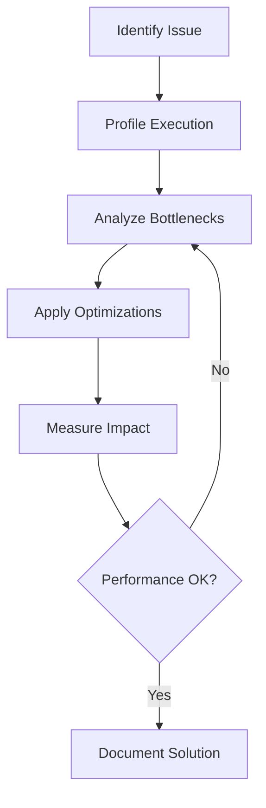

# Performance Debugging Guide

This guide helps you identify, diagnose, and resolve performance issues when using AWS Trainium and Inferentia.

## 🎯 Performance Optimization Workflow



## 📊 Performance Profiling Tools

### 1. Neuron System Tools

#### neuron-monitor
```bash
# Real-time monitoring
neuron-monitor

# Log to file
neuron-monitor --output neuron_metrics.log

# Monitor specific metrics
neuron-monitor --metric neuron_utilization,memory_used
```

**Key Metrics to Watch**:
- **Neuron Core Utilization**: Should be >80% for optimal performance
- **Memory Usage**: Monitor for memory pressure
- **Model Load Time**: Time to load compiled models
- **Execution Time**: Time per inference/training step

#### neuron-profile
```bash
# Enable profiling
export NEURON_PROFILE=/tmp/neuron_profile

# Run your model
python your_model.py

# Analyze profile
neuron-profile view /tmp/neuron_profile
```

### 2. PyTorch XLA Profiling

```python
import torch_xla.debug.profiler as xp

# Start profiling
server = xp.start_server(9012)

# Your model code here
outputs = model(inputs)

# View in browser: http://localhost:9012
```

### 3. Custom Performance Monitoring

```python
import time
import torch
import torch_xla.core.xla_model as xm

class PerformanceMonitor:
    def __init__(self):
        self.metrics = {}
    
    def time_operation(self, name):
        """Context manager for timing operations."""
        return TimedOperation(name, self.metrics)
    
    def log_memory_usage(self, checkpoint_name):
        """Log current memory usage."""
        if torch.cuda.is_available():
            memory_used = torch.cuda.memory_allocated() / 1024**3  # GB
            memory_cached = torch.cuda.memory_reserved() / 1024**3
            self.metrics[f"{checkpoint_name}_memory"] = {
                "used_gb": memory_used,
                "cached_gb": memory_cached
            }
    
    def print_summary(self):
        """Print performance summary."""
        print("Performance Summary:")
        print("=" * 50)
        for name, value in self.metrics.items():
            if isinstance(value, dict):
                print(f"{name}:")
                for k, v in value.items():
                    print(f"  {k}: {v:.3f}")
            else:
                print(f"{name}: {value:.3f}s")

class TimedOperation:
    def __init__(self, name, metrics_dict):
        self.name = name
        self.metrics = metrics_dict
    
    def __enter__(self):
        if torch.cuda.is_available():
            torch.cuda.synchronize()
        self.start_time = time.time()
        return self
    
    def __exit__(self, *args):
        if torch.cuda.is_available():
            torch.cuda.synchronize()
        elif hasattr(xm, 'wait_device_ops'):
            xm.wait_device_ops()
        
        self.metrics[self.name] = time.time() - self.start_time

# Usage example
monitor = PerformanceMonitor()

with monitor.time_operation("model_forward"):
    outputs = model(inputs)

with monitor.time_operation("loss_computation"):
    loss = criterion(outputs, targets)

monitor.log_memory_usage("after_forward")
monitor.print_summary()
```

## 🔍 Common Performance Issues

### Issue 1: Low Neuron Utilization

**Symptoms**:
- `neuron-monitor` shows <50% utilization
- Training/inference slower than expected

**Diagnosis**:
```python
def diagnose_utilization():
    # Check if model is compiled for Neuron
    import torch_neuronx
    
    # Verify XLA devices are being used
    import torch_xla.core.xla_model as xm
    device = xm.xla_device()
    print(f"Using device: {device}")
    
    # Check if tensors are on XLA device
    sample_tensor = torch.randn(10, 10)
    print(f"Tensor device: {sample_tensor.device}")
    
    # Move to XLA device
    sample_tensor = sample_tensor.to(device)
    print(f"Tensor device after move: {sample_tensor.device}")

diagnose_utilization()
```

**Solutions**:

1. **Ensure Neuron Compilation**:
```python
import torch_neuronx

# Compile model for Neuron
example_input = torch.randn(1, 3, 224, 224)
model_neuron = torch_neuronx.trace(model, example_input)

# Use compiled model
outputs = model_neuron(inputs)
```

2. **Optimize Batch Size**:
```python
def find_optimal_batch_size(model, sample_input):
    """Find optimal batch size for throughput."""
    batch_sizes = [1, 2, 4, 8, 16, 32, 64]
    results = {}
    
    for bs in batch_sizes:
        try:
            # Create batch
            batch_input = sample_input.repeat(bs, 1, 1, 1)
            
            # Warm up
            for _ in range(5):
                _ = model(batch_input)
            
            # Benchmark
            start_time = time.time()
            for _ in range(10):
                _ = model(batch_input)
            
            elapsed = time.time() - start_time
            throughput = (bs * 10) / elapsed
            
            results[bs] = throughput
            print(f"Batch size {bs}: {throughput:.2f} samples/sec")
            
        except RuntimeError as e:
            print(f"Batch size {bs}: Failed ({e})")
            break
    
    optimal_bs = max(results.keys(), key=lambda k: results[k])
    print(f"Optimal batch size: {optimal_bs}")
    return optimal_bs
```

### Issue 2: Memory Bottlenecks

**Symptoms**:
- Out of memory errors
- Memory usage keeps increasing
- Reduced batch sizes needed

**Diagnosis**:
```python
import psutil
import torch

def diagnose_memory():
    # System memory
    mem = psutil.virtual_memory()
    print(f"System memory: {mem.used/1024**3:.1f}GB / {mem.total/1024**3:.1f}GB")
    
    # GPU memory (if available)
    if torch.cuda.is_available():
        print(f"GPU memory: {torch.cuda.memory_allocated()/1024**3:.1f}GB allocated")
        print(f"GPU memory: {torch.cuda.memory_reserved()/1024**3:.1f}GB reserved")
    
    # Check for memory leaks
    import gc
    print(f"Python objects: {len(gc.get_objects())}")

# Monitor memory throughout training
def memory_monitor_decorator(func):
    def wrapper(*args, **kwargs):
        diagnose_memory()
        result = func(*args, **kwargs)
        diagnose_memory()
        return result
    return wrapper

@memory_monitor_decorator
def training_step(model, batch, optimizer):
    optimizer.zero_grad()
    outputs = model(batch)
    loss = compute_loss(outputs, batch)
    loss.backward()
    optimizer.step()
    return loss
```

**Solutions**:

1. **Gradient Checkpointing**:
```python
# Enable gradient checkpointing to trade compute for memory
model.gradient_checkpointing_enable()

# Or apply to specific layers
for layer in model.transformer.layers:
    layer = torch.utils.checkpoint.checkpoint_wrapper(layer)
```

2. **Memory-Efficient Training**:
```python
def memory_efficient_training(model, dataloader, optimizer):
    accumulation_steps = 4  # Effective batch size = batch_size * accumulation_steps
    
    for i, batch in enumerate(dataloader):
        # Scale loss by accumulation steps
        with torch.autocast('cuda'):  # Use mixed precision
            outputs = model(batch)
            loss = compute_loss(outputs, batch) / accumulation_steps
        
        loss.backward()
        
        # Update weights every accumulation_steps
        if (i + 1) % accumulation_steps == 0:
            optimizer.step()
            optimizer.zero_grad()
            
            # Clear cache
            if torch.cuda.is_available():
                torch.cuda.empty_cache()
```

3. **Model Sharding for Large Models**:
```python
def shard_large_model(model, num_shards=2):
    """Simple model sharding for memory reduction."""
    layers = list(model.children())
    shard_size = len(layers) // num_shards
    
    shards = []
    for i in range(0, len(layers), shard_size):
        shard = torch.nn.Sequential(*layers[i:i+shard_size])
        shards.append(shard)
    
    return shards

# Usage
def forward_with_shards(shards, x):
    for shard in shards:
        x = shard(x)
        # Optionally move intermediate results to CPU
        # x = x.cpu()  # Uncomment if needed
    return x
```

### Issue 3: Data Loading Bottlenecks

**Symptoms**:
- Low GPU/Neuron utilization during training
- High CPU usage
- Training pauses between batches

**Diagnosis**:
```python
import time
from torch.utils.data import DataLoader

def profile_dataloader(dataloader):
    """Profile data loading performance."""
    total_time = 0
    data_time = 0
    
    start = time.time()
    for i, batch in enumerate(dataloader):
        data_end = time.time()
        data_time += data_end - start
        
        # Simulate model processing
        time.sleep(0.1)  # Replace with actual model forward pass
        
        total_time += time.time() - start
        start = time.time()
        
        if i >= 10:  # Profile first 10 batches
            break
    
    print(f"Data loading time: {data_time:.2f}s ({data_time/total_time*100:.1f}%)")
    print(f"Total time: {total_time:.2f}s")
    
    if data_time / total_time > 0.3:
        print("⚠️ Data loading is a bottleneck!")
    else:
        print("✅ Data loading performance is good")
```

**Solutions**:

1. **Optimize DataLoader**:
```python
# Optimized DataLoader configuration
dataloader = DataLoader(
    dataset,
    batch_size=32,
    shuffle=True,
    num_workers=4,              # Use multiple worker processes
    pin_memory=True,            # Faster GPU transfer
    persistent_workers=True,    # Keep workers alive between epochs
    prefetch_factor=2,          # Prefetch batches
    drop_last=True              # Avoid small last batch
)
```

2. **Async Data Loading**:
```python
import threading
import queue

class AsyncDataLoader:
    def __init__(self, dataloader, device, queue_size=2):
        self.dataloader = dataloader
        self.device = device
        self.queue = queue.Queue(maxsize=queue_size)
        self.thread = None
    
    def _load_data(self):
        for batch in self.dataloader:
            # Move to device in background thread
            batch = {k: v.to(self.device, non_blocking=True) 
                    for k, v in batch.items()}
            self.queue.put(batch)
        self.queue.put(None)  # Signal end
    
    def __iter__(self):
        self.thread = threading.Thread(target=self._load_data)
        self.thread.start()
        
        while True:
            batch = self.queue.get()
            if batch is None:
                break
            yield batch
        
        self.thread.join()
```

3. **Efficient Data Preprocessing**:
```python
import torch.jit

# Compile preprocessing for speed
@torch.jit.script
def preprocess_batch(images: torch.Tensor) -> torch.Tensor:
    # Normalize
    mean = torch.tensor([0.485, 0.456, 0.406]).view(1, 3, 1, 1)
    std = torch.tensor([0.229, 0.224, 0.225]).view(1, 3, 1, 1)
    
    images = images.float() / 255.0
    images = (images - mean) / std
    return images

# Use in DataLoader transform
class FastTransform:
    def __call__(self, batch):
        return preprocess_batch(batch)
```

### Issue 4: Compilation Performance

**Symptoms**:
- Long compilation times
- Frequent recompilation
- Different input shapes causing recompilation

**Diagnosis**:
```python
def diagnose_compilation():
    import os
    
    # Check if compilation caching is enabled
    cache_url = os.environ.get('NEURON_COMPILE_CACHE_URL')
    print(f"Compilation cache: {cache_url or 'Not enabled'}")
    
    # Check compilation timeout
    timeout = os.environ.get('NEURON_COMPILE_TIMEOUT', '900')
    print(f"Compilation timeout: {timeout}s")
    
    # Enable verbose compilation logging
    os.environ['NEURON_COMPILE_VERBOSE'] = '1'
```

**Solutions**:

1. **Enable Compilation Caching**:
```bash
# Enable persistent compilation cache
export NEURON_COMPILE_CACHE_URL=s3://your-bucket/neuron-cache
# Or local cache
export NEURON_COMPILE_CACHE_URL=/tmp/neuron-cache
```

2. **Optimize for Fixed Shapes**:
```python
def create_shape_optimized_models(base_model, common_shapes):
    """Pre-compile models for common input shapes."""
    compiled_models = {}
    
    for shape_name, shape in common_shapes.items():
        print(f"Compiling for shape {shape_name}: {shape}")
        example_input = torch.randn(*shape)
        
        compiled_model = torch_neuronx.trace(base_model, example_input)
        compiled_models[shape] = compiled_model
    
    return compiled_models

# Usage
common_shapes = {
    'batch_1': (1, 3, 224, 224),
    'batch_8': (8, 3, 224, 224),
    'batch_32': (32, 3, 224, 224)
}

compiled_models = create_shape_optimized_models(model, common_shapes)

def get_model_for_batch(batch_size):
    if batch_size <= 1:
        return compiled_models[(1, 3, 224, 224)]
    elif batch_size <= 8:
        return compiled_models[(8, 3, 224, 224)]
    else:
        return compiled_models[(32, 3, 224, 224)]
```

3. **Compilation Monitoring**:
```python
import time
import torch_neuronx

def timed_compilation(model, example_input, name="model"):
    """Time compilation process."""
    print(f"Starting compilation of {name}...")
    start_time = time.time()
    
    try:
        compiled_model = torch_neuronx.trace(model, example_input)
        compilation_time = time.time() - start_time
        print(f"✅ {name} compiled successfully in {compilation_time:.1f}s")
        return compiled_model, compilation_time
    
    except Exception as e:
        compilation_time = time.time() - start_time
        print(f"❌ {name} compilation failed after {compilation_time:.1f}s: {e}")
        return None, compilation_time
```

## 📈 Performance Optimization Strategies

### 1. Model Architecture Optimization

```python
def optimize_model_for_neuron(model):
    """Apply Neuron-specific optimizations."""
    
    # Replace inefficient operations
    for name, module in model.named_modules():
        # Replace LayerNorm with optimized version
        if isinstance(module, torch.nn.LayerNorm):
            setattr(model, name, OptimizedLayerNorm(module.normalized_shape))
        
        # Fuse operations where possible
        if isinstance(module, torch.nn.Sequential):
            fused_module = fuse_sequential_modules(module)
            setattr(model, name, fused_module)
    
    return model

class OptimizedLayerNorm(torch.nn.Module):
    """Neuron-optimized LayerNorm implementation."""
    def __init__(self, normalized_shape, eps=1e-5):
        super().__init__()
        self.normalized_shape = normalized_shape
        self.eps = eps
        self.weight = torch.nn.Parameter(torch.ones(normalized_shape))
        self.bias = torch.nn.Parameter(torch.zeros(normalized_shape))
    
    def forward(self, x):
        # Use manual implementation for better Neuron compatibility
        mean = x.mean(dim=-1, keepdim=True)
        var = ((x - mean) ** 2).mean(dim=-1, keepdim=True)
        x_norm = (x - mean) / torch.sqrt(var + self.eps)
        return x_norm * self.weight + self.bias
```

### 2. Training Loop Optimization

```python
def optimized_training_loop(model, dataloader, optimizer, device):
    """Optimized training loop for Neuron."""
    
    model.train()
    scaler = torch.cuda.amp.GradScaler()  # For mixed precision
    
    for epoch in range(num_epochs):
        epoch_start = time.time()
        
        for batch_idx, batch in enumerate(dataloader):
            step_start = time.time()
            
            # Move batch to device (async if possible)
            batch = {k: v.to(device, non_blocking=True) 
                    for k, v in batch.items()}
            
            # Forward pass with autocast
            with torch.autocast('cuda'):
                outputs = model(**batch)
                loss = outputs.loss
            
            # Backward pass
            scaler.scale(loss).backward()
            
            # Gradient clipping
            scaler.unscale_(optimizer)
            torch.nn.utils.clip_grad_norm_(model.parameters(), 1.0)
            
            # Optimizer step
            scaler.step(optimizer)
            scaler.update()
            optimizer.zero_grad()
            
            # Logging
            if batch_idx % 10 == 0:
                step_time = time.time() - step_start
                print(f"Epoch {epoch}, Step {batch_idx}: "
                      f"Loss {loss:.4f}, Time {step_time:.2f}s")
        
        epoch_time = time.time() - epoch_start
        print(f"Epoch {epoch} completed in {epoch_time:.1f}s")
```

### 3. Inference Optimization

```python
def optimized_inference(model, inputs, batch_size=32):
    """Optimized inference with batching."""
    
    model.eval()
    all_outputs = []
    
    with torch.no_grad():
        # Process in optimal batch sizes
        for i in range(0, len(inputs), batch_size):
            batch = inputs[i:i + batch_size]
            
            # Pad batch to consistent size if needed
            if len(batch) < batch_size:
                padding_size = batch_size - len(batch)
                padding = torch.zeros(padding_size, *batch.shape[1:])
                batch = torch.cat([batch, padding], dim=0)
            
            outputs = model(batch)
            
            # Remove padding from outputs
            if len(batch) < batch_size:
                outputs = outputs[:len(batch)]
            
            all_outputs.append(outputs)
    
    return torch.cat(all_outputs, dim=0)
```

## 🎯 Performance Benchmarking

### Systematic Performance Testing

```python
class PerformanceBenchmark:
    def __init__(self, model, device):
        self.model = model
        self.device = device
        self.results = {}
    
    def benchmark_throughput(self, input_shape, batch_sizes=[1, 4, 8, 16, 32]):
        """Benchmark throughput across different batch sizes."""
        results = {}
        
        for batch_size in batch_sizes:
            try:
                # Create input
                input_data = torch.randn(batch_size, *input_shape[1:]).to(self.device)
                
                # Warmup
                for _ in range(10):
                    _ = self.model(input_data)
                
                # Benchmark
                torch.cuda.synchronize() if torch.cuda.is_available() else None
                start_time = time.time()
                
                num_iterations = 50
                for _ in range(num_iterations):
                    _ = self.model(input_data)
                
                torch.cuda.synchronize() if torch.cuda.is_available() else None
                end_time = time.time()
                
                total_samples = batch_size * num_iterations
                throughput = total_samples / (end_time - start_time)
                results[batch_size] = throughput
                
                print(f"Batch size {batch_size:2d}: {throughput:6.1f} samples/sec")
                
            except RuntimeError as e:
                print(f"Batch size {batch_size:2d}: Failed - {e}")
                break
        
        self.results['throughput'] = results
        return results
    
    def benchmark_latency(self, input_shape, num_runs=100):
        """Benchmark inference latency."""
        input_data = torch.randn(1, *input_shape[1:]).to(self.device)
        latencies = []
        
        # Warmup
        for _ in range(10):
            _ = self.model(input_data)
        
        # Benchmark
        for _ in range(num_runs):
            torch.cuda.synchronize() if torch.cuda.is_available() else None
            start_time = time.time()
            
            _ = self.model(input_data)
            
            torch.cuda.synchronize() if torch.cuda.is_available() else None
            end_time = time.time()
            
            latencies.append((end_time - start_time) * 1000)  # Convert to ms
        
        latency_stats = {
            'mean': np.mean(latencies),
            'median': np.median(latencies),
            'p95': np.percentile(latencies, 95),
            'p99': np.percentile(latencies, 99),
            'std': np.std(latencies)
        }
        
        self.results['latency'] = latency_stats
        print(f"Latency stats (ms): Mean={latency_stats['mean']:.2f}, "
              f"P95={latency_stats['p95']:.2f}, P99={latency_stats['p99']:.2f}")
        
        return latency_stats
    
    def generate_report(self):
        """Generate comprehensive performance report."""
        print("\nPerformance Benchmark Report")
        print("=" * 50)
        
        if 'throughput' in self.results:
            print("\nThroughput Results:")
            for batch_size, throughput in self.results['throughput'].items():
                print(f"  Batch {batch_size:2d}: {throughput:8.1f} samples/sec")
        
        if 'latency' in self.results:
            print(f"\nLatency Results:")
            stats = self.results['latency']
            print(f"  Mean:   {stats['mean']:6.2f} ms")
            print(f"  Median: {stats['median']:6.2f} ms")
            print(f"  P95:    {stats['p95']:6.2f} ms")
            print(f"  P99:    {stats['p99']:6.2f} ms")

# Usage
benchmark = PerformanceBenchmark(model, device)
benchmark.benchmark_throughput((1, 3, 224, 224))
benchmark.benchmark_latency((1, 3, 224, 224))
benchmark.generate_report()
```

## 📋 Performance Checklist

### Before Optimization
- [ ] Baseline performance measurements taken
- [ ] Profiling tools enabled
- [ ] System monitoring in place
- [ ] Compilation caching configured

### Model Optimization
- [ ] Model compiled for Neuron (`torch_neuronx.trace`)
- [ ] Optimal batch size determined
- [ ] Fixed input shapes used
- [ ] Unsupported operators identified and replaced

### Data Pipeline
- [ ] DataLoader optimized (num_workers, pin_memory)
- [ ] Async data loading implemented
- [ ] Preprocessing optimized/compiled
- [ ] Memory usage monitored

### Training/Inference
- [ ] Mixed precision enabled where appropriate
- [ ] Gradient checkpointing used for memory efficiency
- [ ] Proper synchronization points added
- [ ] Memory leaks checked and fixed

### System Level
- [ ] Neuron utilization >80%
- [ ] Memory usage optimized
- [ ] No unnecessary CPU bottlenecks
- [ ] Cost monitoring in place

---

*For interactive performance debugging, use the troubleshooting tool: `python docs/troubleshooting/interactive_diagnosis.py --issue performance`*